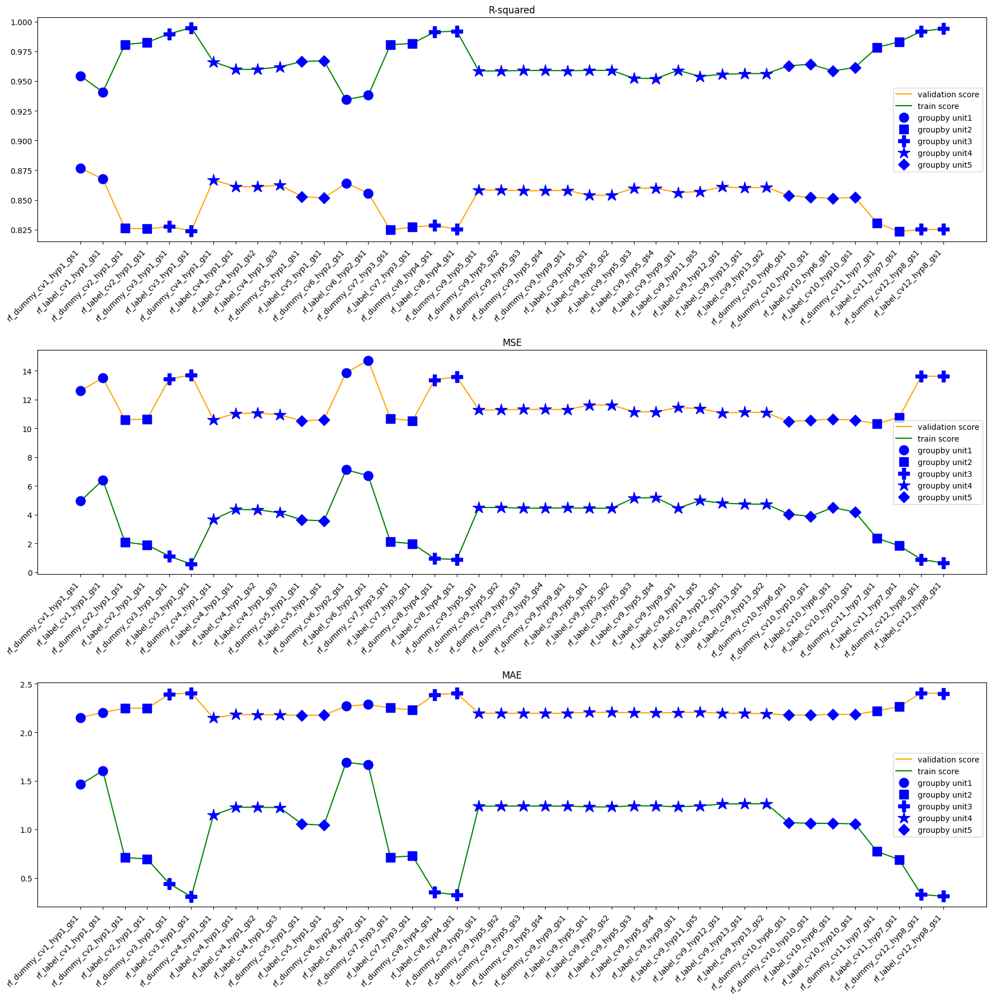
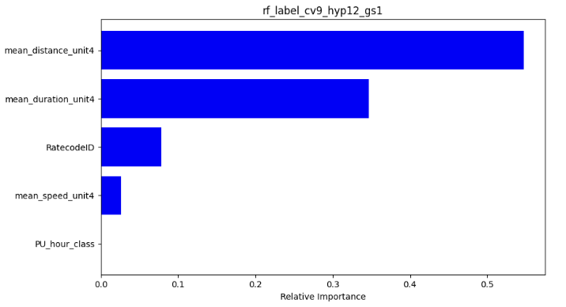
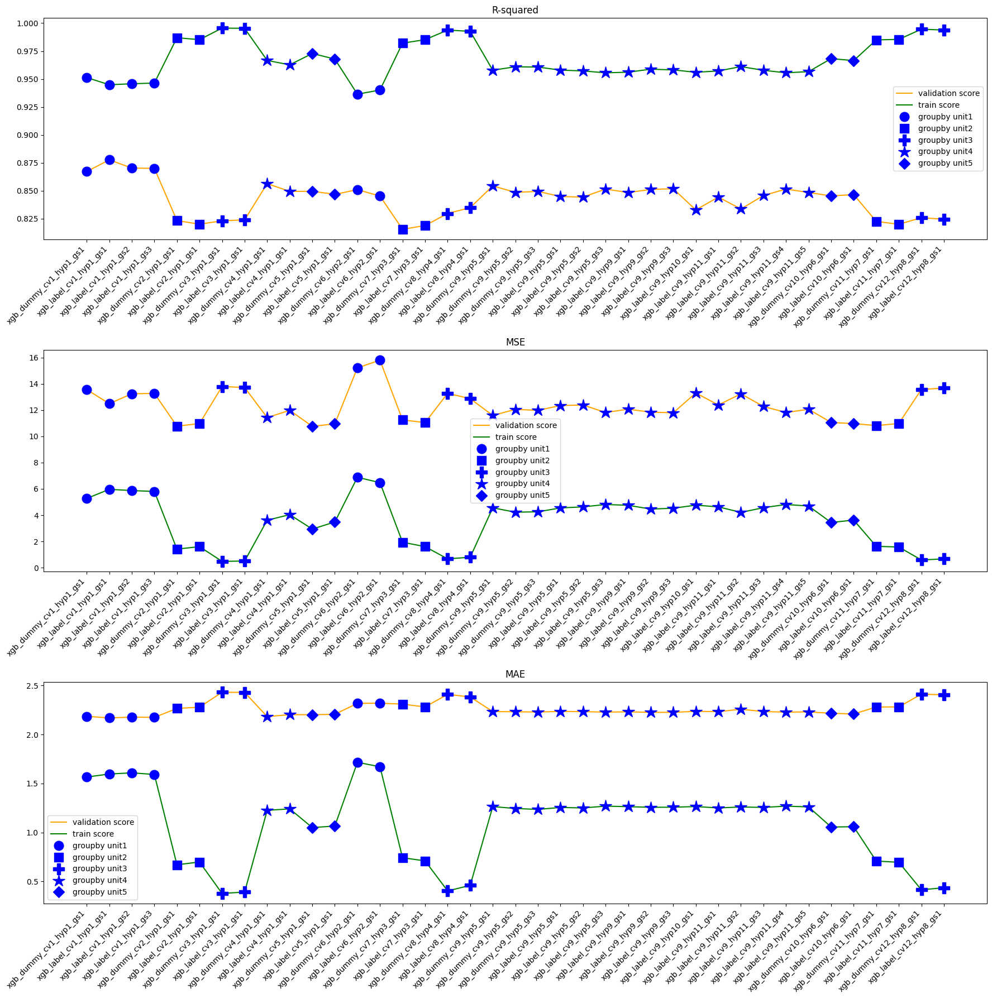

# Terms of Use

This portfolio showcases my skills in data analysis, machine learning, and related areas. 
Each project contains Jupyter Notebooks with code, explanations, and documentation of my thought process.

**Code License:** The code within these Jupyter Notebooks is licensed under the [MIT License](./LICENSE) for the purpose of evaluation by potential employers.

**Non-Code Content License:** The ideas, documentation, and explanations within these Jupyter Notebooks are licensed under the Creative Commons Attribution-NonCommercial-NoDerivatives 4.0 International License (CC BY-NC-ND 4.0).  You can view the license details here: [https://creativecommons.org/licenses/by-nc-nd/4.0/](https://creativecommons.org/licenses/by-nc-nd/4.0/)

**Purpose:** These projects are solely intended for demonstrating my skills to potential employers during my job search.

**Commercial Use and Distribution:** Commercial use or distribution of these projects (beyond evaluation for hiring purposes) is strictly prohibited without my explicit permission.

For any inquiries, please contact me at liucheng.july@outlook.com.

# Yellow Taxi Fare Amount Prediction
* Linear Regression model
* Random Forest Regression model
* XGBoost Regression model

## Documentation Structure
| Directory/File         | Description                                               |
|------------------------|-----------------------------------------------------------|
| `README.md`             | High-level introduction, project purpose, getting started, and documentation structure overview. |
| `LICENSE`                | Code License for the code within these Jupyter Notebooks for purpose of evaluation by potential employers. |
| `LICENSE-NON-CODE`       | License for the ideas, documentation, and explanations within these Jupyter Notebooks  |
| `code/`                 | Jupyter Notebooks of my data projects |
| `code/taxi-fareamount-prediction-eda.ipynb`  | Jupyter Notebook of EDA|
| `code/nyc-taxi-fare-amount-linear-regression.ipynb`  | Jupyter Notebook of linear regression model|
| `code/nyc-taxi-fare-amount-random-forest-regression.ipynb`  | Jupyter Notebook of random forest regression model|
| `code/nyc-taxi-fare-amount-xgboost-regression.ipynb` | Jupyter Notebook of XGBoost regression model|
| `images/`             | images of my data projects                        |
| `data/`             | data set of my data projects                        |
| `data/2017_Yellow_Taxi_Trip_Data.csv`| NYC Yellow Taxi 2017 trip data(dataset from Google Advanced Data Analytics Certificate by Coursera)|
| `data/2017_ratecode_Eq_6.csv` | NYC Yellow Taxi 2017 trip data for RatecodeID=6|
| `data/2017_taxi_sample_Equal_RatecodeID.csv`| NYC Yellow Taxi 2017 trip data for equal RatecodeID proportion|
| `data/taxi_zone_lookup.csv`| NYC Taxi Zone data |
| `data/location_intersection.csv`| NYC Taxi Zone intersection and distance information|
| `data/2017_NYC_holiday.csv`| NYC holiday in 2017|
| `data/taxi_trip_clean.csv`  | NYC Yellow Taxi 2017 trip data after data cleaning for building models |

## Background
This is my portfolio project from Google Advanced Data Analytics Certificate by Coursera.
Since 1971, TLC has been regulating and overseeing the licensing of New York City's taxi cabs, for-hire vehicles, commuter vans, and paratransit vehicles.
In this fictional scenario, the New York City Taxi and Limousine Commission (TLC) has approached the data consulting firm Automatidata to develop an app that enables TLC riders to estimate the taxi fares in advance of their ride.

## Data
* [2017_Yellow_Taxi_Trip_Data.csv](https://www.nyc.gov/site/tlc/about/tlc-trip-record-data.page): NYC Yellow Taxi 2017 trip data(dataset from Google Advanced Data Analytics Certificate by Coursera)
* [2017_ratecode_Eq_6.csv](https://www.nyc.gov/site/tlc/about/tlc-trip-record-data.page): NYC Yellow Taxi 2017 trip data for RatecodeID=6(sample data taken from 2017 yellow taxi trip data with the condition RateCodeID=6)
* [2017_taxi_sample_Equal_RatecodeID.csv](https://www.nyc.gov/site/tlc/about/tlc-trip-record-data.page): NYC Yellow Taxi 2017 trip data(sample data taken from 2017 yellow taxi trip data with the condition equal RateCodeID proportion)
* [taxi_zone_lookup.csv](https://www.nyc.gov/site/tlc/about/tlc-trip-record-data.page): NYC Taxi Zone data
* location_intersection.csv: NYC Taxi Zone intersection information, record neighbour or not, shortest distance between two taxi zone. Calculated from other data, some data source were deleted, may not be accurate, please do not use it for any decision making.
* 2017_NYC_holiday.csv: NYC holiday data in 2017, information from net search results.
* [New York City Gasoline and Diesel Retail Prices.csv](https://www.eia.gov/dnav/pet/pet_pri_gnd_dcus_y35ny_w.htm): New York City Gasoline and Diesel Retail Prices(Dollars per Gallon), deleted some columns. Used for EDA, if necessary please download from website.
* [open-meteo-nyc-2017.csv](https://open-meteo.com/en/docs/historical-weather-api#latitude=40.7143&longitude=-74.006&start_date=2016-01-01&end_date=2022-10-25&hourly=temperature_2m,relative_humidity_2m,dew_point_2m,apparent_temperature,precipitation,rain,snowfall,snow_depth,pressure_msl,surface_pressure,cloud_cover,cloud_cover_low,cloud_cover_mid,cloud_cover_high,wind_speed_10m,wind_speed_100m,wind_direction_10m,wind_direction_100m,wind_gusts_10m&timezone=America%2FNew_York): New York City Hourly weather in 2017. Used for EDA, if necessary please download from website.

**2017_Yellow_Taxi_Trip_Data & 2017_ratecode_Eq_6 & 2017_taxi_sample_Equal_RatecodeID** 
| Column Name           | Type  | Description |
| :---                  | :---  | :--- |
| ID                    | int64 | Trip identification number. |
| VendorID              | int64 | A code indicating the TPEP provider that provided the record.  1= Creative Mobile Technologies, LLC; 2= VeriFone Inc.|
| tpep_pickup_datetime  | object| The date and time when the meter was engaged.  |
| tpep_dropoff_datetime | object| The date and time when the meter was disengaged.  |
| passenger_count       | int64 | The number of passengers in the vehicle.    This is a driver-entered value.|
| trip_distance         | float64| The elapsed trip distance in miles reported by the taximeter.|
| RatecodeID            | int64 | The final rate code in effect at the end of the trip.  1= Standard rate  2=JFK  3=Newark  4=Nassau or Westchester  5=Negotiated fare  6=Group ride|
| store_and_fwd_flag    | object| This flag indicates whether the trip record was held in vehicle memory before being sent to the vendor, aka “store and forward,”  because the vehicle did not have a connection to the server.   Y= store and forward trip  N= not a store and forward trip|
| PULocationID          | int64 | TLC Taxi Zone in which the taximeter was engaged.|
| DOLocationID          | int64 |TLC Taxi Zone in which the taximeter was disengaged. |
| payment_type          | int64   | A numeric code signifying how the passenger paid for the trip. 1= Credit card 2= Cash 3= No charge 4= Dispute 5= Unknown 6= Voided trip    |
| fare_amount           | float64 | The time-and-distance fare calculated by the meter.|
| extra                 | float64 | Miscellaneous extras and surcharges. Currently, this only includes the $0.50 and $1 rush hour and overnight charges. |
| mta_tax               | float64 | $0.50 MTA tax that is automatically triggered based on the metered  rate in use.|
| tip_amount            | float64 | Tip amount – This field is automatically populated for credit card  tips. Cash tips are not included. |
| tolls_amount          | float64 | Total amount of all tolls paid in trip.  |
| improvement_surcharge | float64 | $0.30 improvement surcharge assessed trips at the flag drop. The  improvement surcharge began being levied in 2015. |
| total_amount          | float64 | The total amount charged to passengers. Does not include cash tips.|

**taxi_zone_lookup**
| Column Name           | Type   | Description |
| :---                  | :---   | :--- |
| LocationID            | int64  | TLC Taxi Zone |
| Borough               | object | New York City Borough Name|
| Zone                  | object | Taxi Zone name (e.g. Newark Airport)|
| service_zone          | object | Taxi service zone(e.g. Boro Zone, Yellow Zone)|

**location_intersection**
| Column Name             | Type   | Description |
| :---                    | :---   | :--- |
| PULocationID            | int64  | Pickup taxi zone                          |
| PU_isEdge               | object | Pickup taxi zone is boundary of NYC or not|
| DOLocationID            | int64  | Dropoff taxi zone |
| DO_isEdge               | object | Dropoff taxi zone is boundary of NYC or not|
| Intersection            | object | Pickup taxi zone and Dropoff taxi zone are neighbours or not|
| PU_DO_Shortest_distance | object | Shortest distance between two taxi zone(Do not consider road, it's shortest line distance)|

**New York City Gasoline and Diesel Retail Prices**
| Column Name           | Type   | Description |
| :---                  | :---   | :--- |
| Date                  | object | Date |
| NYC_All_Grades_All_Formulations_Retail_Gasoline_Prices | float64| Weekly New York City All Grades All Formulations Retail Gasoline Prices  (Dollars per Gallon)|

**2017_NYC_holiday**
* [timeanddate](https://www.timeanddate.com/holidays/us/2017?hol=43122559)
* [2017 Public Hearing/Meeting Calendar](https://www.nyc.gov/assets/lpc/downloads/pdf/calendar/2017-calendar-lpc.pdf)
* [cityclerk](https://www.cityclerk.nyc.gov/content/legal-holidays)

| Column Name           | Type   | Description |
| :---                  | :---   | :--- |
| Date                  | object | Date |
| Holiday               | object | Holiday (e.g. Christmas Day) |
| Day_of_the_week       | object | Weekday name (e.g. Sunday) |
| Type                  | object | Holiday type(Federal holidays or State holidays) |

**[open-meteo-nyc-2017](https://open-meteo.com/en/docs/historical-weather-api)**
* Please refer 'Hourly Parameter Definition' section in [open-meteo](https://open-meteo.com/en/docs/historical-weather-api) for the latest information

| Column                     | Type          | Description |
|:-       |:-      |:----------------------------------------------|
| time                       | object| date time             |  
| temperature_2m (°C)        | float64       | Air temperature at 2 meters above ground|
| relative_humidity_2m (%)   | int64         | Relative humidity at 2 meters above ground|
| dew_point_2m (°C)          | float64       | Dew point temperature at 2 meters above ground|
| apparent_temperature (°C)  | float64       | Perceived feels-like temperature combining wind chill factor, relative humidity, and solar radiation|
| precipitation (mm)         | float64       | Total precipitation (rain, showers, snow) sum of the preceding hour|
| rain (mm)                  | float64       | Only liquid precipitation of the preceding hour including local showers and rain from large scale systems|
| snowfall (cm)              | float64       | Snowfall amount of the preceding hour in centimeters|
| snow_depth (m)             | float64       | Snow depth on the ground, measured instantaneously in meters.   |
| pressure_msl (hPa)         | float64       | Atmospheric air pressure reduced to mean sea level (msl)|
| surface_pressure (hPa)     | float64       | Pressure at the surface, measured instantaneously in hPa. Surface pressure gets lower with increasing elevation.  |
| cloud_cover (%)            | int64         | Total cloud cover as an area fraction |
| cloud_cover_low (%)        | int64         | Low level clouds and fog up to 2 km altitude|
| cloud_cover_mid (%)        | int64         | Mid level clouds from 2 to 6 km altitude|
| cloud_cover_high (%)       | int64         | High level clouds from 6 km altitude |
| wind_speed_10m (km/h)      | float64       | Wind speed at 10 meters above ground. Wind speed on 10 meters is the standard level. |
| wind_speed_100m (km/h)     | float64       | Wind speed at 100 meters above ground. Wind speed on 10 meters is the standard level. |
| wind_direction_10m (°)     | int64         | Wind direction at 10 meters above ground |
| wind_direction_100m (°)    | int64         | Wind direction at 100 meters above ground |
| wind_gusts_10m (km/h)      | float64       | Gusts at 10 meters above ground of the indicated hour |

### Detail

* Check data
  * check duplicates
  * check missing value
  * check VendorID (compare data dictionary defination and dataset value) 
  * check RateCodeID (compare data dictionary defination and dataset value) 
  * check store_and_fwd_flag (compare data dictionary defination and dataset value) 
  * check PULocationID (compare data dictionary defination and dataset value) 
  * check DOLocationID (compare data dictionary defination and dataset value) 
  * check payment_type (compare data dictionary defination and dataset value) 
  * check total_amount = fare_amount+extra+mta_tax+tip_amount+tolls_amount+improvement_surcharge
  * check passenger_count
  * check tpep_pickup_datetime format
  * check tpep_dropoff_datetime format
  * check tpep_pickup_datetime complete (include all date in 2017)
  * check tpep_dropoff_datetime complete (include all date in 2017)
  * check date from to (check tpep_pickup_datetime <=tpep_dropoff_datetime)
* Clean data(Part1)
  * delete total_amount != fare_amount+extra+mta_tax+tip_amount+tolls_amount
  * delete trip tpep_pickup_datetime > tpep_dropoff_datetime
* Clean data(Part2)

|Check Item|Description|How to Handle|
|:-        |:-   |:-                 |
|check RatecodeID|Check if RatecodeID is [0-265]|Delete|
|check LocationID|Check if LocationID is 264|Delete|
|check Payment Type|Check if payment type is Credit card or Cash|Delete|
|Check duration|Check limits on Consecutive Hours of Driving.  A Driver must not operate a Vehicle for more than 12 consecutive hours.|Delete|
|Check Speed|Check if average speed is within the speed limit|Delete|
|Check Distance(Range)|0<distance <=Max speed limit * min(duration, max work time)|Delete|
|Check Distance(Relation)|Check if the relation betweeen trip distance and LocationID are valid PULocationID = DOLocationID, trip_distance >= 0 (valid) PULocationID and DOLocationID are neighbour, trip_distance >= 0 (valid) PULocationID and DOLocationID are NOT neighbour, trip_distance < geo shortest distance (invalid) PULocationID and DOLocationID neighbour unknown, trip_distance = 0 (valid)|Delete|
|Check Fare amount|Check if fare_amount follow [TLC Taxi Fare](https://www.nyc.gov/site/tlc/passengers/taxi-fare.page)|Delete|
|Check RatecodeID setting|Check if RatecodeID setting follow TLC Rule|Delete|
|Check Trip with change|Check if a trip is a trip with something(payment) change |Delete|
|Check Pickup location|Check if Pickup Locaion is outside of NYC|Delete|
|Check check_tax_surcharge|Check if extra,mta_tax and Improvement surcharge is correct|Delete|
|Check rushhour surcharge|Check if the rush hour surcharge is correct(Consider pickup time)|Keep|
|Check night time surcharge|Check if the night time surcharge is correct(Consider pickup time)|Keep|

* Perform EDA
* Perform Hypothesis test

* Build [Linear Regression model](Activity_Course%205%20Automatidata%20project%20lab.ipynb)
    * &rarr; Not meet assumptions
* Build Random Forest Regression model
    * train and val scores of random forest models
    
    * feature importance of champion model

    
    * champion model mean distance, speed, duration group by unit:PU_DO_LocationID + PU_hour_class
    * Champion model score

|Score	|R-squared |Adjusted R-squared|MSE	     |MAE        |AIC        |BIC          |
|:-     |:-        |:-                |:-        |:-         |:-         |:-           |
|Train  |0.955608  |0.955595          |4.801582	 |1.261479   |57972.936530|58010.358556|
|Val    |0.860884  |0.860649          |11.064115 |2.194817   |12464.003707|12492.869575|
|Test	|0.837947  |0.837794          |13.425096 |2.249483   |23065.281979|23097.045930|

* Build XGBoost Regression model
    * train and val scores of XGBoost models
    

**Model Result**
* mean_distance, mean_duration, RatecodeID are important features that could help predict fare amount.
* 86% of fare_amount in validation set could be explained by the model with MSE 11.06 dollars and MAE 2.19 dollars. 83.8% of fare_amount in test set could be explained by the model with MSE 13.43 dollars and MAE 2.25 dollars.

**Recommendations**
* The bellowing table is check result of data check
    * Around 1.53% of trips contained taxi zone 264(unknown) with different RatecodeID
        * Assumptions: geo and taxi zone mapping table is not complete, network issue
        * Recommendation: further investigate and analyze the reason, it it due to incomplete mapping table update mapping table, if it due to network issue, keep watching the count.
    * Around 2% of trips rush hour surcharge and night time surcharge didn’t follow the TLC rule. 
        * Assumptions: timer/clock setting is incorrect(e.g. time synchronization issue, summer time/winter time setting inccorect, machine issue) , holiday setting is incorrect
        * Recommendation: further investigate and analyze the reason.  If it due to incorrect setting we could consider monitor this issue, add time setting check to taxi inspection check list or add it to driver training course. 
    * Around 0.7% of trips payment type were not cash or credit card. 
        * Assumptions: vendor system inner payment status to handle some special trips(cancelled or unpaid trips) or used for labeling data.
        * Recommendation: keep watching the proportion, if change a lot further investigate and analyze.
    * Around 0.66% of trips distance were within the valid range(0<distance<=Max speed limit * min(duration, max work time)). 
        * Assumptions: Passengers change mind, traffic jam, machine issue, noise
        * Recommendation: further investigate and analyze the reason, especially error count by driver and vehicle. If certain driver or vehicle has higher count than others, it might indicate incorrect behavior or machine issue. If no trends or patterns we could keep watching the proportion.
    * Around 0.5% of trips RatecodeID setting didn't follow TLC rule.
        * Assumptions: incorrect behavior, operation mistake
        * Recommendation: further analyze, especially by driver. If certain driver has higher count than others, it might indicate incorrect behavior. If it due to incorrect behavior, in short term keep monitor behavior, in mid-long term penalize incorrect behavior and upgrade tech system which could automatically set RatecodeID.
    * Around 0.19% of trips duration were more than 720 minutes, exceeded driving time limitation(12 hours), all of them were Vendor VeriFone Inc.
        * Assumptions: system issues, test data, special business flow/service(duration were around 12 hours or 24 hours)
        * Recommendation: further investigate and analyze the reason.

<table border="1" class="dataframe">
  <thead>
    <tr style="text-align: right;">
      <th></th>
      <th>Check Item</th>
      <th>invalid count</th>
      <th>invalid percentage(%)</th>
    </tr>
  </thead>
  <tbody>
    <tr>
      <th>0</th>
      <td>check_LocationID</td>
      <td>346</td>
      <td>1.529</td>
    </tr>
    <tr>
      <th>1</th>
      <td>check_rushhour_surcharge</td>
      <td>234</td>
      <td>1.032</td>
    </tr>
    <tr>
      <th>2</th>
      <td>check_nighttime_surcharge</td>
      <td>248</td>
      <td>1.094</td>
    </tr>
    <tr>
      <th>3</th>
      <td>check_payment</td>
      <td>165</td>
      <td>0.728</td>
    </tr>
    <tr>
      <th>4</th>
      <td>check_distance</td>
      <td>150</td>
      <td>0.662</td>
    </tr>
    <tr>
      <th>5</th>
      <td>check_RatecodeID_setting</td>
      <td>117</td>
      <td>0.516</td>
    </tr>
    <tr>
      <th>6</th>
      <td>check_duration</td>
      <td>43</td>
      <td>0.190</td>
    </tr>
    <tr>
      <th>7</th>
      <td>check_nochange_trip</td>
      <td>33</td>
      <td>0.146</td>
    </tr>
    <tr>
      <th>8</th>
      <td>check_speed</td>
      <td>28</td>
      <td>0.124</td>
    </tr>
    <tr>
      <th>9</th>
      <td>check_fare_amount</td>
      <td>26</td>
      <td>0.115</td>
    </tr>
    <tr>
      <th>10</th>
      <td>check_tax_surcharge</td>
      <td>21</td>
      <td>0.093</td>
    </tr>
    <tr>
      <th>11</th>
      <td>check_distance_relation</td>
      <td>11</td>
      <td>0.049</td>
    </tr>
    <tr>
      <th>12</th>
      <td>check_pu_location</td>
      <td>9</td>
      <td>0.040</td>
    </tr>
    <tr>
      <th>13</th>
      <td>check_RatecodeID</td>
      <td>0</td>
      <td>0.000</td>
    </tr>
  </tbody>
</table>
* The above data is 22629, the result of deleting incorrect start,end time trips

* Other business recommendation:
  * The Standard Lease Cap Rate showed variability based on the day of the week, time of day (daytime/nighttime), and vehicle power type (hybrid or non-hybrid). Furthermore, the price of each weekday appears correlated with the corresponding weekday's trip counts. This suggests a potential association between the Standard Lease Cap Rate and trip counts. Observational data indicates a significant reduction in trip counts during holidays (e.g. Christmas) and extreme weather conditions (e.g. the heavy snowfall on March 14th). If this decrease in trip counts reflects decreased taxi demand and the Standard Lease Cap Rate is indeed linked to trip counts, implementing limitations during holidays and extreme weather events could protect drivers' well-being. Moreover, the increasing frequency of extreme weather events may compel drivers to terminate their leases. Under the standard cancellation fee policy, some drivers might feel pressured to operate vehicles during hazardous conditions to avoid these charges. To mitigate this risk, particularly for short-term leases (e.g. daily or weekly), consideration should be given to implementing restrictions on cancellation fees during periods of extreme weather, thereby safeguarding drivers' well-being.

